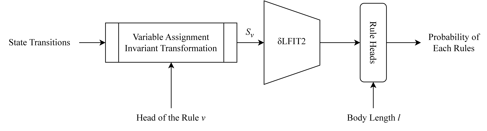

</img>

## δLFIT2

This is the official implementation for δLFIT2.

## Install

Setup an environment with Python virtual environment or Anaconda, then do the following:

```bash
$ git clone https://github.com/phuayj/delta-lfit-2.git
$ pip install -e .
```

## Usage

To train the δLFIT2 model, first you have to generate the dataset. The generation process utilizes Redis for potential distributed generation.
While generating large datasets, it is recommended that you disable Redis' background save.

```bash
$ python generate_dataset.py
```

By default, the training dataset for 3 variables will be generated. Once the dataset is generated, you can proceed towards training.

```bash
$ python train.py
```

For variables larger than 3, you can also run a multi-gpu training.

```bash
$ accelerate launch train_accelerator.py
```

## Citation

Coming soon.
